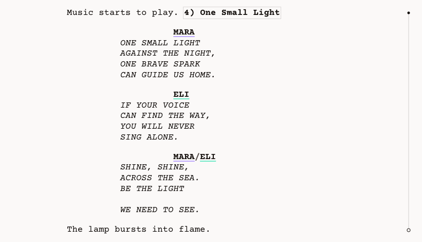

<p align="center">
  <a href="https://stagistic.app">
    
  </a>
</p>

<h1 align="center">Stagistic Editor</h1>

<h3 align="center">A free, open-source script editor built for theatre and musicals</h3>

<p align="center">
  <a href="https://editor.stagistic.app"><b>Open the editor</b></a> ·
  <a href="https://stagistic.app">Website</a> ·
  <a href="https://stagistic.app/editor/syntax">Stagistic Syntax</a> ·
  <a href="LICENSE">MIT licence</a>
</p>

---

Your play is not a screenplay with the camera removed. Most script software is built for film: `INT./EXT.`, shots and cuts. Stagistic Editor is built around the way theatre actually works — acts, scenes, characters, stage directions, lyrics and music cues — and exports a correctly formatted, print-ready PDF.

It runs in your browser, needs no account, and stores your scripts locally by default.

<p align="center">
  
</p>

# Features

### Playwriting structure

- **Dedicated blocks** for acts, scene headings, character cues, dialogue, stage directions, lyrics and notes — each with its own formatting and behaviour
- **Stage directions** inline within dialogue or as standalone blocks, with tagged characters
- **Live outline** of acts and scenes — jump to any scene, reorder scenes, group them into acts, collapse scenes
- **Automatic numbering** of scenes and musical numbers

### Characters

- **Character catalogue** built directly from your script
- **Colours and highlighting** of each character's appearances
- **Groups and ensembles**, alternate names, safe renaming across the whole script
- **Simultaneous dialogue** for two or more characters speaking together
- **Vocal ranges** and linking several characters to one actor

### Musical theatre

- **Lyrics** as a first-class block type, toggled against dialogue with a shortcut
- **Music catalogue** of songs and instrumentals
- **Music cues** placed in the script, with the covered passage highlighted up to the end of the number
- **Score PDFs** attached to individual musical numbers

### Writing flow

- **Configurable formatting** — page format, title page, headers and footers, and per-block indentation, alignment, emphasis and casing
- **Keyboard shortcuts** and a configurable "next block" flow
- **Comments** — discussion threads anchored to text or whole blocks, shown in the margin or beside the script
- **Search** within the script

### Export

- **Print-ready PDF** with a live preview
- **Integrated score export** — script and attached score PDFs merged into one document with continuous page numbering
- **Contents and character list** options (scenes, musical numbers, character ordering)

### Your data

- **Local-first** — scripts live in your browser; no account or sign-in
- **Backups** — download a `.stagistic` (script) or `.stepkg` (script + metadata + assets) file and import it again at any time
- **Open format** — [Stagistic Syntax](https://stagistic.app/editor/syntax), a readable plain-text format for plays and musicals

# Roadmap

- **Cloud sync** — optional and free
- **Mobile and tablet support** — the editor currently needs a screen at least 1000 px wide
- **Desktop app** — offline-first Tauri shell (`apps/desktop`, early stage)
- **Production apps** — tools for directors, stage managers and production teams, working from the same script

# Development

Requirements: **Node.js ≥ 24.12**, **pnpm ≥ 11**. Tasks run through [moon](https://moonrepo.dev).

```bash
pnpm install
moon run web:dev        # editor app
moon run landing:dev    # stagistic.app website
```

Checks:

```bash
moon run root:typecheck
moon run root:lint
moon run root:test
moon run <project>:test-browser   # app-core, app-routes, editor, ui
```

### Repository layout

| Path                                       | Contents                                      |
| ------------------------------------------ | --------------------------------------------- |
| `apps/web`                                 | The editor app (editor.stagistic.app)         |
| `apps/landing`                             | The website (stagistic.app), built with Astro |
| `apps/desktop`                             | Desktop shell (Tauri), work in progress       |
| `packages/editor`                          | The script editor (Tiptap / ProseMirror)      |
| `packages/script`                          | Script document model and Stagistic Syntax    |
| `packages/script-pagination`               | Page layout of the script                     |
| `packages/export`                          | PDF export                                    |
| `packages/stepkg`                          | `.stagistic` backup package format            |
| `packages/db`                              | Local database (PGlite + Drizzle)             |
| `packages/app-core`, `packages/app-routes` | App state and screens                         |
| `packages/ui`                              | Shared UI components and design tokens        |

# Contributing

Bug reports, ideas and pull requests are welcome. Please open an [issue](https://github.com/littlewall/stagistic/issues) first for larger changes.

# About

Stagistic is made by [Milan Zítka](https://github.com/littlewall) — a software developer with more than 15 years of experience and an author of musicals. I built it for my own writing, and I'm offering it free to the whole theatre community, because the ability to write for the stage shouldn't depend on paying for basic software.

# Licence

[MIT](LICENSE)

<sub>Stagistic is an independent project and is not affiliated with, sponsored by, or endorsed by Final Draft or any other script software. All product names are property of their respective owners.</sub>
