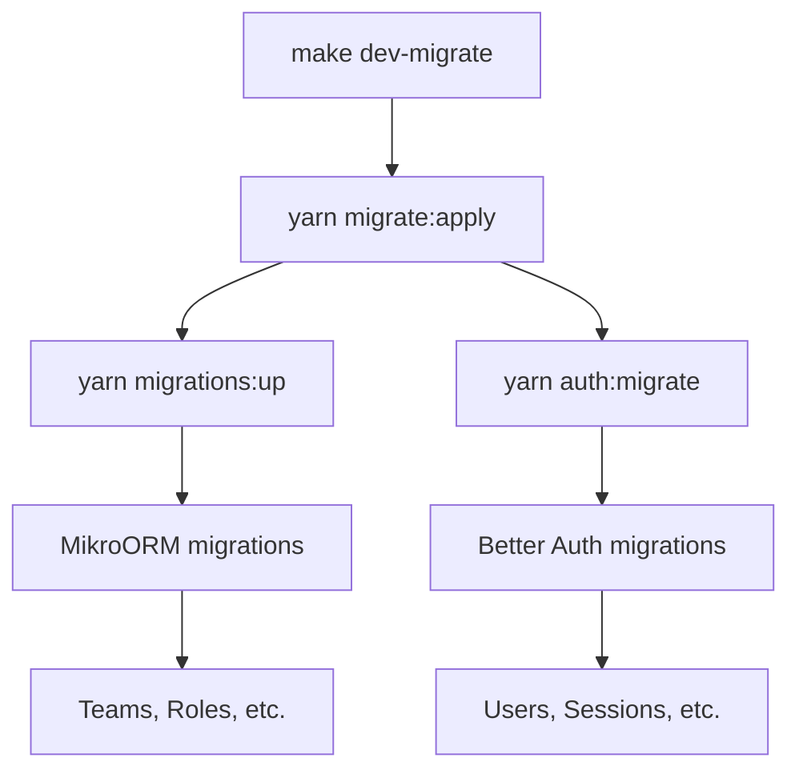

# Unified Migrations Setup

## Overview

This document explains the unified migration system that allows you to run all database migrations (MikroORM + Better Auth) with a single command.

## Changes Made

### 1. Shared Better Auth Configuration

**Problem:** Configuration was duplicated in `auth.config.ts` and `app/lib/auth/auth.server.ts`

**Solution:** Created shared configuration function in `app/lib/auth/config.ts`

```
app/lib/auth/
├── config.ts           # 🆕 Shared configuration function
├── auth.server.ts      # Uses shared config
└── ...

auth.config.ts          # Uses shared config (for CLI)
```

**Benefits:**
- ✅ Configuration defined in ONE place
- ✅ Changes automatically sync
- ✅ No duplication
- ✅ Type-safe

### 2. Unified Migration Commands

**New NPM Scripts:**

```bash
# Generate all migrations
yarn migrate:generate        # Better Auth schema generation

# Apply all migrations
yarn migrate:apply           # MikroORM + Better Auth

# Local (with env loading)
yarn migrate:local:generate  # Generate with .env.local
yarn migrate:local:apply     # Apply all with .env.local
```

**New Makefile Commands:**

```bash
# Development
make dev-migrate            # Run ALL migrations

# Production
make prod-migrate           # Run ALL migrations
```

### 3. Migration Order

Migrations run in this order:
1. **MikroORM migrations** - Application entities (teams, roles, etc.)
2. **Better Auth migrations** - Authentication tables (users, sessions, etc.)

**Note:** Better Auth creates the `user` table, which may conflict with older MikroORM migrations. This is handled gracefully - the script continues even if MikroORM fails.

## Usage

### Quick Start

**In Docker (Recommended):**
```bash
make dev-migrate
```

**Locally:**
```bash
yarn migrate:local:apply
```

### Individual Systems

If you need to run migrations separately:

**MikroORM only:**
```bash
make dev-migrate-up        # Docker
yarn migrations:up         # Local
```

**Better Auth only:**
```bash
make dev-auth-migrate      # Docker
yarn auth:migrate          # Local
```

## Configuration Files

### `app/lib/auth/config.ts`
Shared Better Auth configuration function:
- Defines plugins (magicLink, emailOTP)
- Configurable email sending callbacks
- Used by both app and CLI

### `app/lib/auth/auth.server.ts`
Application auth instance:
- Imports shared config
- Provides real email sending via Postmark
- Used by Remix app

### `auth.config.ts` (root)
CLI auth instance:
- Imports shared config
- Uses console.log for email (schema generation only)
- Used by Better Auth CLI

## How It Works

### Shared Configuration Pattern

```typescript
// app/lib/auth/config.ts
export function createAuthConfig(options) {
  return {
    database: options.database,
    plugins: [
      magicLink({ ... }),
      emailOTP({ ... }),
    ],
  };
}

// app/lib/auth/auth.server.ts (Application)
export const auth = betterAuth(
  createAuthConfig({
    database: pool,
    sendMagicLink: async ({email, url}) => {
      await sendTemplateEmail(email, 'magic-link', {magic_link: url});
    },
    ...
  })
);

// auth.config.ts (CLI)
export const auth = betterAuth(
  createAuthConfig({
    database: pool,
    // Uses default console.log implementations
  })
);
```

### Unified Migration Flow



## Production Deployment

Docker Compose automatically runs unified migrations on startup:

```yaml
command: sh -c "yarn migrate:apply && node server.js"
```

This ensures:
1. All migrations run before app starts
2. Both systems are synchronized
3. No manual intervention needed

## Troubleshooting

### MikroORM Migration Errors

If you see errors about existing tables (especially `user`):
- This is expected if Better Auth ran first
- The script continues with Better Auth migrations
- Both systems will be synchronized

### Configuration Changes

**To modify Better Auth configuration:**
1. Edit `app/lib/auth/config.ts` ONLY
2. Changes automatically apply to both app and CLI
3. No need to sync multiple files

### Fresh Database Setup

For a clean database:
```bash
# Drop all tables
make dev-db
# In psql:
DROP SCHEMA public CASCADE;
CREATE SCHEMA public;
\q

# Run all migrations
make dev-migrate
```

## Migration Files

### MikroORM
- **Location:** `migrations/mikro-orm/`
- **Format:** TypeScript
- **Committed:** ✅ Yes

### Better Auth
- **Location:** `migrations/better-auth/`
- **Format:** SQL
- **Committed:** ❌ No (auto-applied)

## See Also

- [Migrations Overview](./migrations-overview.md)
- [Better Auth Migrations](./better-auth-migrations.md)
- [Project Structure](../PROJECT_STRUCTURE.md)
